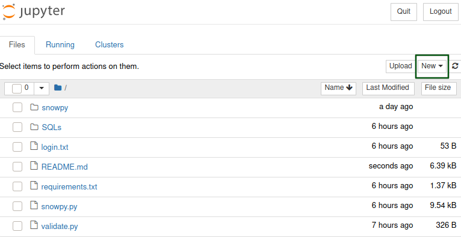
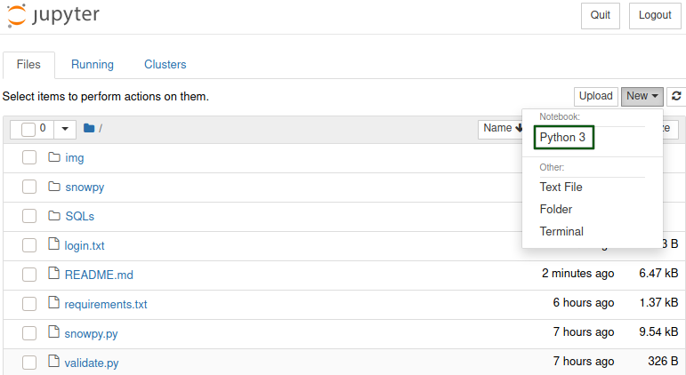
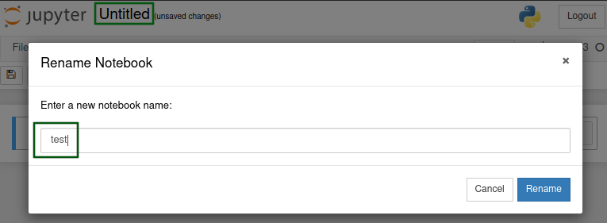
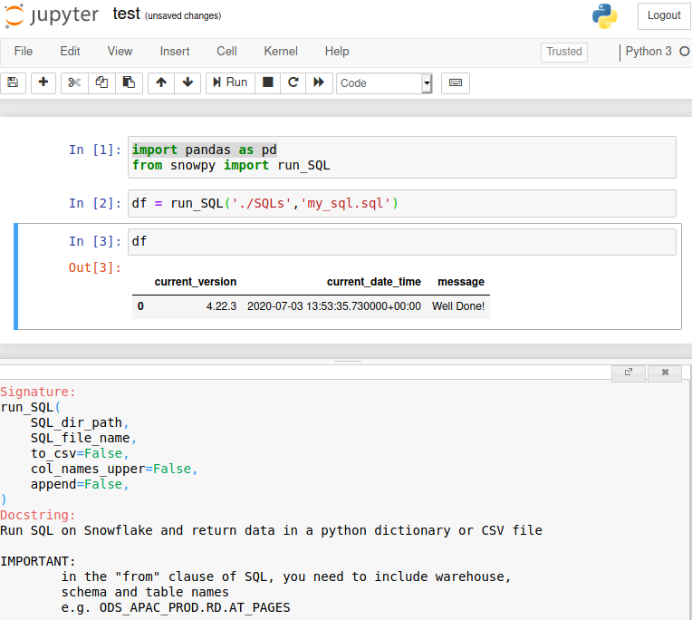

# How to connect to Snowflake and pull data by using Python
This is a quick guide on how to use my **Python** module to streamline your data workflow with Snowflake and Pandas, making data extraction easier.

The module contains two functions. One allows you to pull data from Snowflake and stores them in a csv file or pandas.DataFrame. The second function allows you to pull data from Snowflake and stores them in a feather file.
## Step 1 - **Install required packages**
```bash
pip install snowflake-connector-python[pandas]
```
Then, save the following **Python** script as **validate.py**.
Run it in terminal to check if the package is installed correctly:
```python
import snowflake.connector

# Gets the version
ctx = snowflake.connector.connect(
    user='<your_user_name>',
    password='<your_password>',
    account='<your_account_name>'
    )
cs = ctx.cursor()
try:
    cs.execute("SELECT current_version()")
    one_row = cs.fetchone()
    print(one_row[0])
finally:
    cs.close()
ctx.close()
```
If you not sure about which **account_name** to use like how I was, you can get **account_name** from your Snowflake login URL.

If you login URL looks like the link below:
```
https://<"company_name">.<"region">.snowflakecomputing.com/console/login#/
```
then
```
<"company_name">.<"region">
```
is your **account_name**.

Run the **Python** script once you have entered **user_name**, **password** and **account_name**.

Successful run of **Python** script above shoud look like this:
```bash
user@home:~$ python3 validate.py
4.22.3
```
It's ok if your Snowflake version is different than mine.

One down one to go:
```bash
pip install snowflake-sqlalchemy
```
Complete list of required packages can be find in the [**requirements.txt**](https://github.com/shaunxwang/snowpy/blob/master/requirements.txt)

You can also run:
```bash
pip install -r requirements.txt
```
to save some time.

## Step 2 - **Download the snowpy.py module**

1. **Download**     
   [Download snowpy.py](https://github.com/shaunxwang/snowpy/blob/master/snowpy.py)

   or

   [Clone github repository](https://github.com/shaunxwang/snowpy.git)

   or

   [Download github repository as a zip file](https://github.com/shaunxwang/snowpy/archive/master.zip)
2. **Save in folder**  
   Save the downoaded **snowpy.py** file in our working folder.

   or

   Use the downloaded repository as your working folder, it comes with a **Pyhon virtual environment** with all the required packages which are listed in **requirement.txt**.

If you chose to clone the repository or download it as a zip file, you should have file/folder tree looks like this:
```
Your
working 
folder
    |
    ├── login.txt
    ├── README.md
    ├── requirements.txt
    ├── snowpy
    │   ├── bin
    │   ├── include
    │   ├── lib
    │   ├── lib64 -> lib
    │   ├── pyvenv.cfg
    │   └── share
    ├── snowpy.py
    ├── SQLs
    │   └── my_sql.sql
    └── validate.py
```
## Step 3 - **Create a folder for SQL queries and login.txt**
1. **SQLs folder**  
   Create a folder called **SQLs** to store SQL queries
   ```
   Your
   working 
   folder
    |
    ├── login.txt
    ├── README.md
    ├── requirements.txt
    ├── snowpy
    │   ├── bin
    │   ├── include
    │   ├── lib
    │   ├── lib64 -> lib
    │   ├── pyvenv.cfg
    │   └── share
    ├── snowpy.py
    ├── 'SQLs' <<----------------------------<
    │   └── my_sql.sql
    └── validate.py
    ```
2. **login.txt**
   Create a text file called **login.txt** which contains three lines of text:
   ```
   your_user_name (Snowflake)
   your_user_password (Snowflake)
   your_account_name (Snowflake)
   ```
   change those lines to fit your login details of Snowfake
   ```
   Your
   working 
   folder
    |
    ├── 'login.txt' <<----------------------------<
    ├── README.md
    ├── requirements.txt
    ├── snowpy
    │   ├── bin
    │   ├── include
    │   ├── lib
    │   ├── lib64 -> lib
    │   ├── pyvenv.cfg
    │   └── share
    ├── snowpy.py
    ├── SQLs
    │   └── my_sql.sql
    └── validate.py
   ```

   Then set file permissions of **login.txt** so that _root_ or _group_ can not access it, i.e. only you can access and modify it.

   If you are using a linux machine like I am, you can type the following in terminal:
   ```bash
   chmod go-rwx------ login.txt
   ```
   or
   ```bash
   chmod 600 login.txt
   ```
   Click [here](https://help.ubuntu.com/community/FilePermissions) for detailed explanation of file permissions in linux machines

   It's also a good idea to add **login.txt** to **.gitignore** file so that you don't accidentially ```git commit``` and ```git push``` **login.txt** with your real password to a public repository like **Github** or **Bitbucket**.

## Step 4 - **How to use **snowpy** in Jupyter notebook**
1. **Install Jupyter notebook**
   ```bash
   pip install notebook
   ```
2. **Load Jupyter notebook**
             
   Type the following in terminal
   ```bash
   jupyter notebook
   ```
   Messages below will then show up in terminal, it indicates that Jupyter local server is running:
   ```bash
   [I 22:40:44.894 NotebookApp] Serving notebooks from local directory: /home/user/working_folder
   [I 22:40:44.895 NotebookApp] The Jupyter Notebook is running at:
   [I 22:40:44.895 NotebookApp] http://localhost:8888/?token=0cf9066b55adf4f683097cef877f696b7ad0f11234567890
   [I 22:40:44.895 NotebookApp]  or http://127.0.0.1:8888/?token=0cf9066b55adf4f683097cef877f696b7ad0f11234567890
   [I 22:40:44.895 NotebookApp] Use Control-C to stop this server and shut down all kernels (twice to skip confirmation).
   [C 22:40:45.016 NotebookApp] 
    
    To access the notebook, open this file in a browser:
        file:///home/user/.local/share/jupyter/runtime/nbserver-88888-open.html
    Or copy and paste one of these URLs:
        http://localhost:8888/?token=0cf9066b55adf4f683097cef877f696b7ad0f11234567890
        or http://127.0.0.1:8888/?token=0cf9066b55adf4f683097cef877f696b7ad0f11234567890
   ```
   ```
   Your
   working 
   folder
    |
    ├── login.txt
    ├── README.md
    ├── requirements.txt
    ├── snowpy
    │   ├── bin
    │   ├── include
    │   ├── lib
    │   ├── lib64 -> lib
    │   ├── pyvenv.cfg
    │   └── share
    ├── snowpy.py
    ├── SQLs
    │   └── my_sql.sql
    ├── 'test.ipynb' <<----------------------------<
    └── validate.py
   ```
3. **Create a test jupyter notebook**
   **(A)**
   <br></br>
   **(B)**
   <br></br>
   **(C)**
   <br></br>
   **(D)**

   See below for the test SQL query, **my_sql.sql** which is located in **/SQLs/my_sql.sql**:
   ```sql
   select
        current_version() as CURRENT_VERSION,
        current_timestamp(2) as CURRENT_DATE_TIME,
        'Well Done!' as MESSAGE;
   ```
   ```
   Your
   working 
   folder
    |
    ├── login.txt
    ├── README.md
    ├── requirements.txt
    ├── snowpy
    │   ├── bin
    │   ├── include
    │   ├── lib
    │   ├── lib64 -> lib
    │   ├── pyvenv.cfg
    │   └── share
    ├── snowpy.py
    ├── SQLs
    │   └── 'my_sql.sql' <<----------------------------<
    ├── test.ipynb
    └── validate.py
   ```
   If you intend to use the **second function, run_SQL_to_feather** to store your data on disk in feather format, you need to install an additional package:
   ```bash
   pip install feather-format
   ```
   Feather uses the [Apache Arrow](https://arrow.apache.org/) columnar memory specification to represent binary data on disk. This makes read and write operations very fast.

   ## Logging
   Both functions provide **debuggin** level of **debug** which is deepest level for logging. This level of logging allows you to see what the code has done step-by-step.

   The log file, **snowflake_python_connector_log.txt** is located here:
   ```
   Your
   working 
   folder
    |
    ├── img
    ├── login.txt
    ├── __pycache__
    ├── README.md
    ├── requirements.txt
    ├── 'snowflake_python_connector_log.txt' <<-----------------<
    ├── snowpy
    │   ├── bin
    │   ├── include
    │   ├── lib
    │   ├── lib64 -> lib
    │   ├── pyvenv.cfg
    │   └── share
    ├── snowpy.py
    ├── SQLs
    │   └── my_sql.sql
    ├── test.ipynb
    ├── test.ipynb.md
    └── validate.py
   ```
   It's a good idea to add **snowflake_python_connector_log.txt** to **.gitignore** file so that you don't accidentially ```git commit``` and ```git push``` **snowflake_python_connector_log.txt** to a public repository like **Github** or **Bitbucket**.

   ## Python Virtual Environment
   If you chose to **download** or **clone** from [**Github**](https://github.com/shaunxwang/snowpy/archive/master.zip), the files come with a **Python virtual environment** pre-installed, located here:
   ```
   Your
   working 
   folder
    |
    ├── img
    ├── login.txt
    ├── __pycache__
    ├── README.md
    ├── requirements.txt
    ├── snowflake_python_connector_log.txt
    ├── 'snowpy'  <<----------------------------<
    │   ├── bin
    │   ├── include
    │   ├── lib
    │   ├── lib64 -> lib
    │   ├── pyvenv.cfg
    │   └── share
    ├── snowpy.py
    ├── SQLs
    │   └── my_sql.sql
    ├── test.ipynb
    ├── test.ipynb.md
    └── validate.py
   ```
   If you are using **VS Code** like I am, you can add the following setting to your **.vscode/settings.json** file, so that you will activate and use the pre-installed **Python virtual environment** for testing or just playing around with the two functions.
   ```json
   {
    "python.pythonPath": "snowpy/bin/python"
   }
   ```
   **settings.json** located here:

   ```
   Your
   working 
   folder
    |   
    ├── .git
    ├── .gitignore
    ├── img
    ├── .ipynb_checkpoints
    ├── login.txt
    ├── README.md
    ├── requirements.txt
    ├── snowflake_python_connector_log.txt
    ├── snowpy
    │   ├── bin
    │   ├── include
    │   ├── lib
    │   ├── lib64 -> lib
    │   ├── pyvenv.cfg
    │   └── share
    ├── snowpy.py
    ├── SQLs
    │   └── my_sql.sql
    ├── test.ipynb
    ├── test.ipynb.md
    ├── validate.py
    └── '.vscode' <<----------------------------<
        └── settings.json
   ```